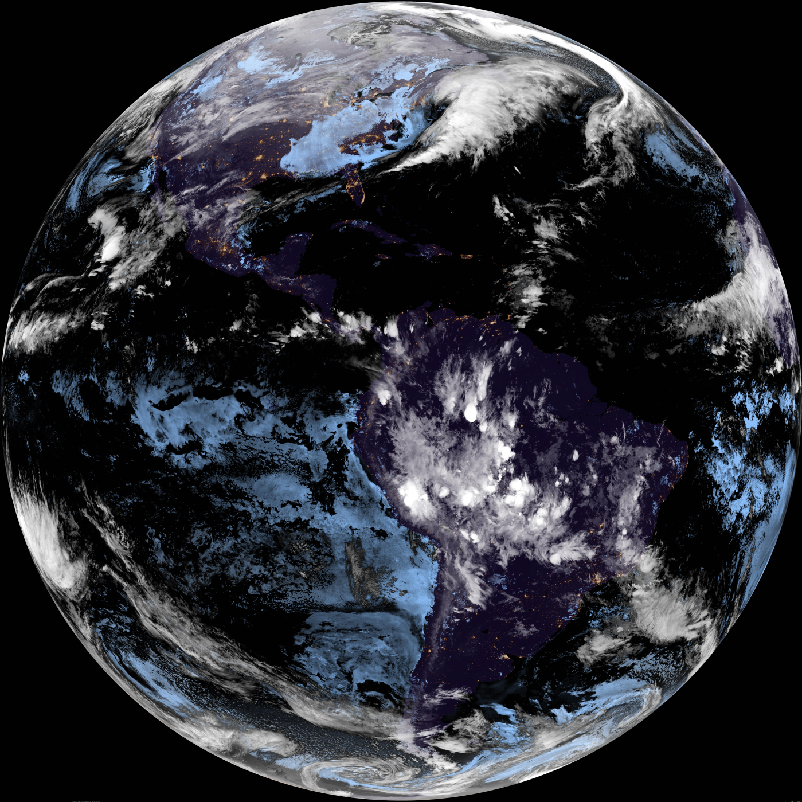
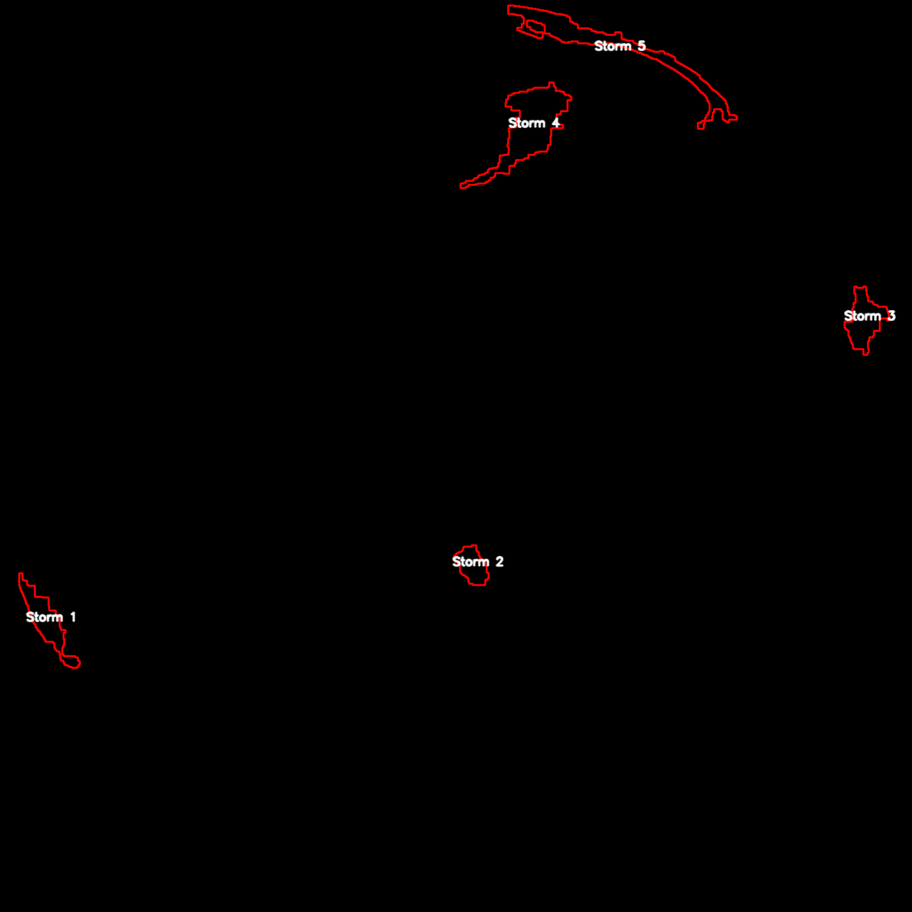
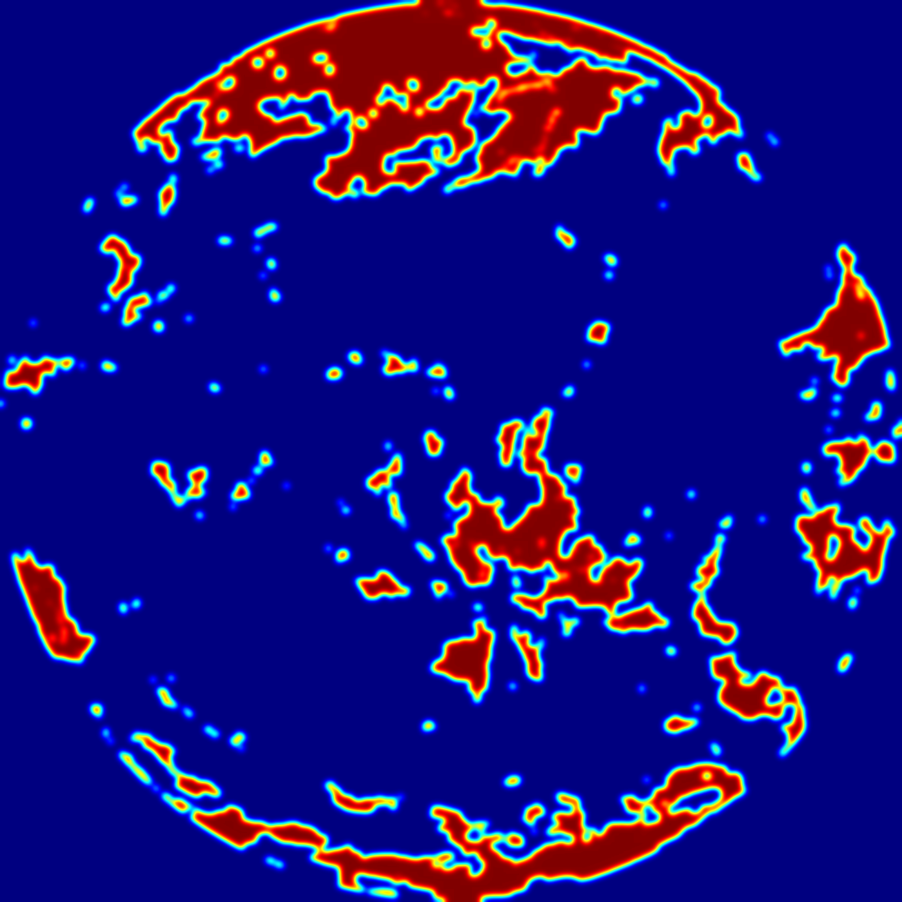

# 🌍 GOES-16 Cloud Analysis Dashboard  
**CPE 462 Final Project — Lily Stone**

---

## 📌 Overview
This project is a Python-based image processing pipeline that downloads the latest **GOES-16 GeoColor satellite image** and analyzes global cloud coverage.

It:
- Detects and classifies cloud types  
- Computes cloud coverage statistics  
- Compares land vs. ocean clouds  
- Identifies storm-like structures  
- Generates a full visual dashboard  

---

## 🛰️ Example Output

### 🌎 Original GeoColor Image


### 🌩️ Storm Detection


### 🔥 Cloud Intensity Heatmap


### 📊 Final Dashboard


---

## 🧠 Processing Pipeline

### 1. Image Download & Preparation
- Fetch latest GOES-16 GeoColor image (NOAA)
- Resize for processing
- Generate unique hash for output folder

---

### 2. Earth Disk Detection
- Detect Earth boundary using non-black pixels  
- Estimate center + radius  
- Used for spatial reference  

---

### 3. Cloud Segmentation
- Convert to HSV color space  
- Create masks for:
  - Thick clouds  
  - Mid-level clouds  
  - Cirrus clouds  
- Apply morphological filtering  
- Combine into global cloud mask  

---

### 4. Cloud Classification
Color-coded visualization:
- 🔴 Thick clouds  
- 🟡 Mid-level clouds  
- 🟣 Cirrus clouds  

---

### 5. Land vs Ocean Analysis
- Detect:
  - Ocean (blue regions)  
  - Land (green/brown regions)  
- Compute:
  - Global cloud coverage  
  - Land cloud coverage  
  - Ocean cloud coverage  

---

### 6. Storm Detection
- Identify large thick-cloud clusters  
- Label each detected storm  
- Compute:
  - Number of storms  
  - Largest storm  
  - Average storm size  

---

### 7. Coastlines + Heatmap
- Edge detection for coastline approximation  
- Smooth heatmap for cloud density  

---

### 8. Dashboard Generation
Final 2×2 visualization:
1. Original + stats  
2. Cloud classification  
3. Storm detection  
4. Heatmap  

---

## 📊 Example Results

```bash
Global cloud cover: 38.53%
Land cloud cover: 32.32%
Ocean cloud cover: 36.31%
Detected 15 storm-like clusters
Largest storm area: 30984.5 px
Average storm area: 7863.9 px
